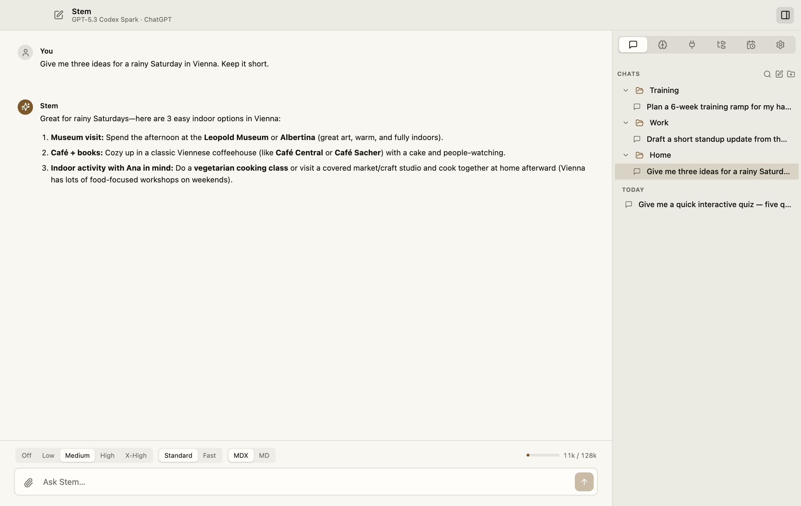

# Chats

← [Stem guide](../README.md)

Maya creates a **Clients** folder, adds a **Northwind** subfolder, and starts a chat
there:

> Review this launch plan. List the three riskiest assumptions.

<!-- TODO(screenshot): Recapture with the canonical Maya demo profile. -->

<picture>
  <source media="(prefers-color-scheme: dark)" srcset="../screenshots/sidebar-spaces-dark.png">
  
</picture>

## Ask

- Drop a file on **This chat** for one message. Drop it on **Files** to copy it into
  Stem for reuse across chats.
- Choose model, effort, speed, and interactive **MDX** or plain **Markdown**.
- More effort can use more quota. **Fast** appears only for supported models and
  increases usage.
- Watch tool activity while Stem works.
- **Web** turns web search on or off for the next message. It stays where you leave
  it, and is the same switch as **Settings → Chat → Web search**. Quick Chat keeps
  its own.
- Web answers include cited sources.
- The context meter shows how full the conversation is.

## Organize and find work

- Use **+** on a folder to start a chat inside it.
- Drag chats and folders to move or nest them.
- Right-click a chat to rename, move, or delete it. Deletion is permanent and also
  removes its scheduled tasks.
- Right-click a folder to create a subfolder, rename, or delete it. Deleting a folder
  moves its chats and child folders to the parent.
- Use **Search**, `⌘F` on Mac, or `Ctrl+F` on Linux to search titles and message
  text across every chat.

## Change a conversation

Hover over a message to reveal its actions:

- **Retry**: run that turn again.
- **Edit and run**: replace your message, then continue from there.
- **Fork**: copy the conversation up to that point into a new chat.
- **Delete from here**: remove that turn and everything after it. Requires a second
  click.

Each chat keeps its selected model and effort. Changing them in one chat does not
rewrite earlier answers.

<!-- TODO(screenshot): Message actions on a user message, including Fork and Delete from here. -->
