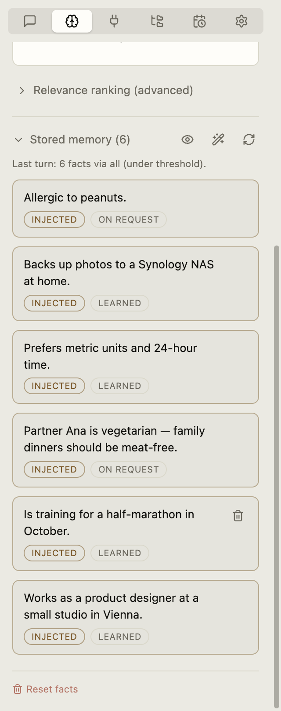

# Memory

← [Stem guide](../../README.md)

With **Memory** on, Stem learns stable, reusable details from ordinary
conversations. You do not need to say “remember this.”

- “My App Source uses pnpm.” in a normal chat may become a **fact** automatically.
- “What did we decide about the Invoices workflow?” can use **Recall**.

Open the right sidebar, choose **Memory**, then choose:

- [**Facts**](facts.md) — durable details Stem can use in later chats.
- [**Recall**](recall.md) — searchable chat history and conversation summaries.

<!-- TODO(screenshot): Recapture with the canonical Maya demo profile. -->

  <picture>
    <source media="(prefers-color-scheme: dark)" srcset="../../screenshots/memory-facts-dark.png">
    
  </picture>

Connected folders can also teach Stem facts. **Memorize** allows retention;
**Learn facts** chooses when learning happens. See
[Connected folders](../connected-folders.md).
