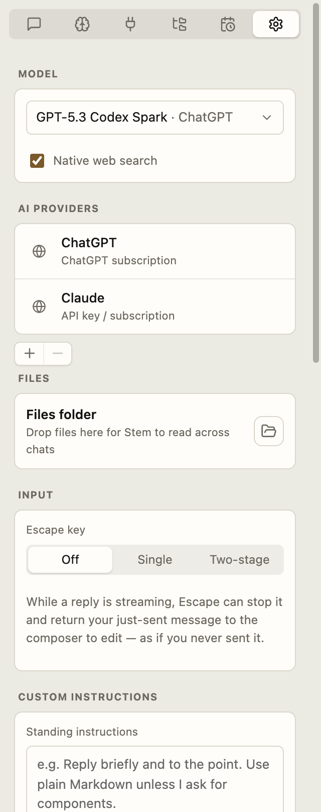

# Settings

← [Stem guide](../README.md)

Maya uses ChatGPT for everyday consulting, adds a local Ollama model for sensitive
drafts, keeps command approval on **Assisted**, and gives Quick Chat short-answer
instructions.

<!-- TODO(screenshot): Recapture with the canonical Maya demo profile. -->

  <picture>
    <source media="(prefers-color-scheme: dark)" srcset="../screenshots/settings-providers-dark.png">
    
  </picture>

## Providers and models

Add a provider with:

- **Account**: ChatGPT, Claude, or Grok sign-in. Grok signs in with a code you
  confirm in the browser (SuperGrok or X Premium).
- **API key**: Anthropic, OpenAI, OpenRouter, or xAI.
- **Local server**: Ollama or LM Studio. Stem hides Ollama models without tool
  support; they cannot complete Stem turns.

The selected model receives the prompt, attachments, and context Stem adds to that
turn. A cloud model receives that data on its provider’s service. A local model
sends it to the server address you configured.

**Web search** works with every model, not only cloud ones, and returns cited
sources. Under **Web search** you choose the backend that runs the search:
**Automatic** ends at one that needs no key, or pick a named one and paste its key.

Two backends need no key of their own because a connected account pays for them:
**ChatGPT / OpenAI** with a ChatGPT sign-in, and **Grok / xAI** with a SuperGrok or
X Premium sign-in. Grok runs the search inside Grok itself, so each search draws on
the same allowance as your Grok chats — one question can use a dozen searches. It is
never picked automatically; select it yourself if you want it.

## Command approvals

Turn **Run commands** off to disable shell commands. With **Assisted**, the selected
safety-check model receives the command and working folder. A cloud model processes
that text on its provider.

- **Manual**: known-safe and always-allowed commands run; everything else asks first.
- **Assisted**: an AI safety check passes routine commands and asks about uncertain
  ones. A convenience, not a security boundary.
- **Yolo**: commands run without asking. Read-only connected folders remain
  protected.

On an approval card, **Always allow** saves a command prefix for future turns.
Keep prefixes narrow; `git status` grants less access than `git`.

On Windows, **Windows shell** chooses Command Prompt (the default) or Git Bash.
Stem looks for Git Bash on disk without using PowerShell. If it is not in a usual
place, paste the path to `bash.exe`. Commands then run in that one shell — quoting
and the always-allowed list follow it (`dir` vs `ls`).

<!-- TODO(screenshot): Command approval card with Allow once, Always allow, and Deny. -->

### Scratch files

Commands run in a folder of their own per chat, so downloads, scripts and build
output stay with the conversation that made them. **Scratch files** lists those
folders biggest-first with the chat each belongs to; **Clear** empties one without
touching the conversation.

A folder goes when you delete its chat, and otherwise once nothing in it — and
nothing in the chat — has been touched for the period you choose (7, 30 or 90 days,
or **Never**). Treat scratch as working space: anything you want to keep belongs in
your Files, which the assistant can copy into and which is not swept. Scratch is
also left behind when you move Stem to another machine.

## Escape key

- **Off** — does nothing while Stem is working.
- **Single** — stops the turn and retracts the sent message.
- **Two-stage** — first press stops; second press retracts.

## Notifications

How a [scheduled task](scheduled-tasks.md) reaches you on a run that found something.

- **Pop-up** — Stem comes to the front and shows the message in a dialog.
- **Nudge** — the dock bounces (the taskbar flashes); focus stays where it is.
- **Inbox only** — nothing interrupts you.

All three leave the task's chat unread in your Inbox, so nothing is missed either
way. Only how much it interrupts changes.

## Context used across chats

- **Files folder**: files Stem may read from any chat. They are not automatically
  attached to every prompt.
- **Standing instructions**: directions applied to the main app and Quick Chat.
- [**Memory**](memory/README.md) and
  [**Connected folders**](connected-folders.md) have their own controls. Their
  enabled, relevant content may be added to a turn.

When Stem proposes changing standing instructions, review the approval card before
accepting.

## Quick Chat defaults

Set a separate model, effort, speed, web-search choice, shortcut, finish sound,
idle reset, and extra instructions. Extra [Quick Chat](quick-chat.md) instructions
are added on top of the standing instructions.

**Show on all displays** lets the overlay follow Spaces and displays. **Show progress
on other Spaces** can also show progress for the main Stem window.

On Linux with Wayland, set the command shown in Settings as a desktop keyboard
shortcut; the recorded global shortcut cannot fire there.

## About

Shows the version you're running — worth quoting when you report a problem.

**Updates** says whether a newer Stem exists and what to do about it. On Linux
(the AppImage) a new release downloads in the background and installs itself the
next time you start Stem — or right away with **Restart now**. On a Mac, **Get
the update** opens the release page and you install it the way you did the first
time. **Check now** asks immediately; **Check for updates automatically** turns
the periodic check off entirely. The check asks one question of GitHub, where
Stem's releases live, and sends nothing about you or your chats.

**Show what's new after an update** opens the release notes once, the first time you
run a new version; the popup has the same switch if you'd rather turn it off there.
**View release notes** opens the full history at any time.
